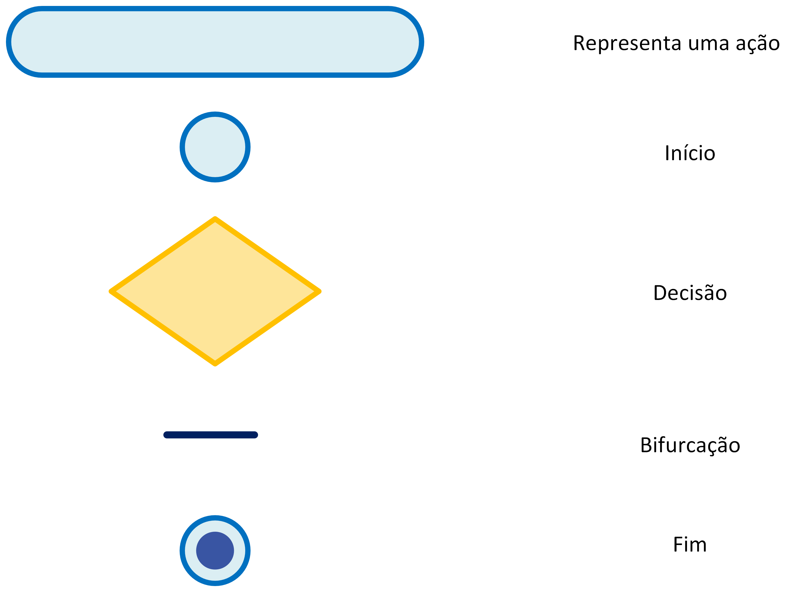
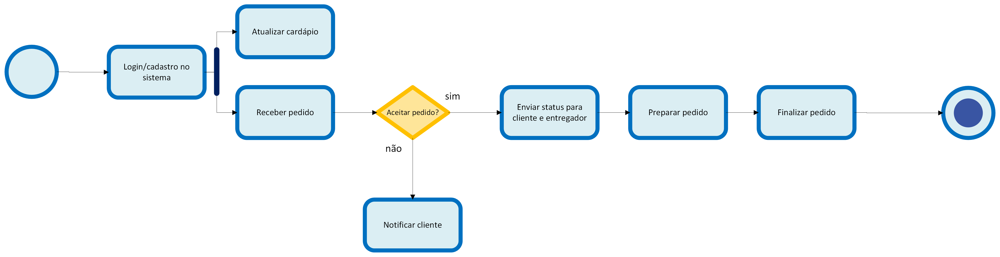
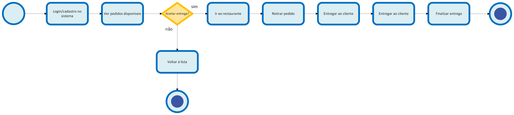
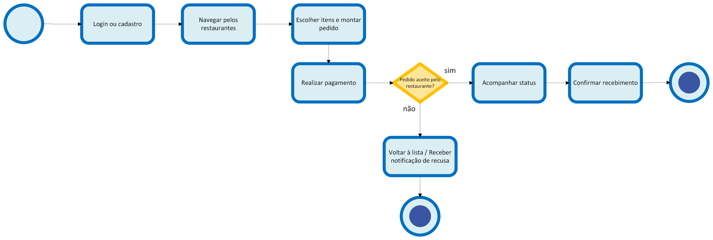

# Diagrama de Atividades

## Introdução

O Diagrama de Atividades é uma das ferramentas da UML (Unified Modeling Language) utilizada para modelar os aspectos dinâmicos de um sistema. Ele foca no fluxo de controle de uma atividade para outra, mostrando a sequência de ações e as condições que governam esse fluxo. É especialmente útil para descrever o fluxo de trabalho (workflow) de um caso de uso, de um processo de negócio ou de uma operação complexa.

## Diagrama
### Legenda

Figura 1: Diagrama de Atividade Legenda dos ícones utilizados.

Fonte: Ana Joyce e Gabriela (2025)

### Fluxo executado pelo o fornecedor

Figura 2: Diagrama de Atividades: Fornecedores.

Fonte: Ana Joyce e Gabriela (2025)

### Fluxo executado pelo o entregador

Figura 3: Diagrama de Atividades: Entregadores.

Fonte: Ana Joyce e Gabriela (2025)

### Fluxo executado pelo o cliente

Figura 4: Diagrama de Atividades: Cliente.

Fonte: Ana Joyce e Gabriela (2025)

## Aplicação no projeto

Os diagramas de atividades foram fundamentais para a modelagem dos processos de negócio do nosso projeto, o "PodePedirFCTE". Eles nos permitiram visualizar e detalhar o fluxo de trabalho para cada um dos três principais atores do sistema: o **Cliente**, o **Fornecedor** (restaurante/lanchonete) e o **Entregador**.

Ao mapear as ações de cada ator, desde o cadastro até a finalização de um pedido, conseguimos uma compreensão clara das interações e dependências entre eles. Por exemplo, o fluxo do cliente de "Realizar Pedido" dispara o fluxo do fornecedor de "Receber Pedido", que por sua vez, após o preparo, aciona o fluxo do entregador com a "Notificação de Entrega".

Essa modelagem nos ajudou a:
- **Identificar Requisitos Funcionais:** Cada ação no diagrama representa um requisito funcional que o sistema deve suportar, como `Atualizar cardápio`, `Acompanhar entrega` e `Aceitar entrega`.
- **Definir a Experiência do Usuário:** Ao entender a sequência de passos de cada ator, podemos projetar interfaces mais intuitivas e que atendam às suas necessidades em cada etapa do processo.
- **Prever Pontos de Falha:** As estruturas de decisão (como "Pedido aceito?" ou "Aceitar entrega?") são pontos críticos. Modelá-las nos permite planejar como o sistema deve se comportar em cenários de sucesso e de falha, garantindo uma maior robustez.

A separação dos fluxos por ator também foi uma decisão de projeto importante, pois simplificou a análise e facilitará o desenvolvimento modular do sistema, onde cada módulo pode ser focado em atender às necessidades de um perfil de usuário específico.

### Dificuldades Encontradas pela equipe

Uma das principais discussões durante a criação dos diagramas foi definir o nível de detalhe adequado. Inicialmente, pensamos em criar um único diagrama abrangendo todos os atores, mas percebemos que ele se tornaria complexo e difícil de entender. A decisão de dividir o fluxo em três diagramas distintos, um para cada ator, foi crucial para manter a clareza e a legibilidade. Outro ponto de debate foi como representar a comunicação entre os diferentes atores, que embora separados em diagramas, interagem constantemente. Optamos por focar no fluxo de atividades de cada um, deixando os detalhes da comunicação para serem modelados em um Diagrama de Sequência.

## Referências

> FOWLER, Martin. UML Distilled: A Brief Guide to the Standard Object Modeling Language. 3. ed. Boston: Addison-Wesley, 2004.
> SERRANO, Milene. VideoAula - DSW-Modelagem - Atividades. Disponível em: https://unbbr-my.sharepoint.com/personal/mileneserrano_unb_br/_layouts/15/stream.aspx?id=%2Fpersonal%2Fmileneserrano%5Funb%5Fbr%2FDocuments%2FArqDSW%20%2D%20V%C3%ADdeosOriginais%2F06c%20%2D%20VideoAula%20%2D%20DSW%2DModelagem%20%2D%20Atividades%2Emp4&ga=1. Acesso em: 21 de set. de 2025.

## Histórico de Versões

| **Data**       | **Versão** | **Descrição**                         | **Autor**                                      | **Revisor**                                      | **Data da Revisão** |
| :--------: | :----: | :-------------------------------- | :----------------------------------------: | :----------------------------------------: | :-------------: |
| 21/09/2025 |  `1.0`   | Criação do documento e adição dos diagramas. | [`@anajoyce`](https://github.com/anajoyceamorim) | [`@Gabriela`](https://github.com/gaubiela) |   21/09/2025    |
