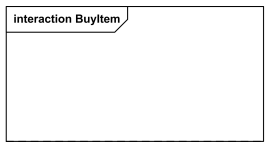
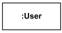
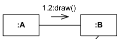
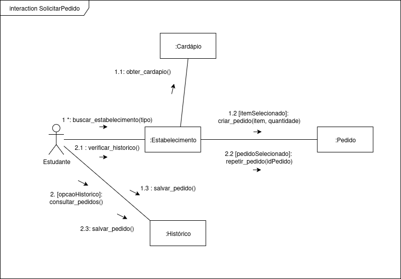

# Diagrama de Colaboração

## Introdução

O **diagrama de colaboração** é um tipo de diagrama de interação da UML (Unified Modeling Language) utilizado para representar como os objetos e/ou partes colaboram entre si em um cenário de uso do sistema.

Ele mostra as interações entre os objetos por meio de mensagens sequenciadas, em uma disposição mais livre, sem depender de uma linha temporal explícita. Dessa forma, enfatiza as conexões e colaborações entre os elementos envolvidos para realizar uma funcionalidade específica.

Esse diagrama corresponde a um **diagrama de sequência simplificado**, pois ambos descrevem as mesmas interações, apenas em perspectivas diferentes. Enquanto o diagrama de sequência foca na ordem temporal, o diagrama de comunicação privilegia a visão estrutural e organizacional das interações.

### Vantagens
- Destaca a **colaboração e relacionamentos** entre os objetos.  
- Fornece uma **visão mais estrutural** das interações do que o diagrama de sequência.  
- Pode ser facilmente convertido para um **diagrama de sequência** e vice-versa.  

### Desvantagens
- Não evidencia de forma clara o **fator temporal** da execução das mensagens.  
- Pode se tornar menos intuitivo em cenários **complexos**, com muitas mensagens ou condições.  

## Diagrama

### Componentes do Diagrama

| **Nome do Componente** | **Significado** | **Representação** |
| :--------------------- | : ------------- | : --------------- |
| Frame | Representa o fluxo de uma interação |  |
| Lifeline | Elemento nomeado que representa um participante individual na interação |  |
| Message | Uma linha de expressão sequencial com uma seta que indica a direção da comunicação |  |

## Aplicação no projeto

O diagrama de colaboração foi criado pensando em algumas das interações que serão necessárias no projeto PodePedirFCTE.

### Interação "Fazer_Pedido"

<strong>Figura 1</strong> – Interação "Fazer_Pedido" - <a href="https://github.com/anabborges">Ana Clara</a>

A interação Fazer Pedido conta com os seguintes elementos (lifelines):
- **:Comprador**: O usuário que está fazendo o pedido.

- **:Interface do Comprador**: A aplicação frontend no dispositivo do comprador.

- **:Servidor do Aplicativo**: O sistema backend que processa toda a lógica.

- **:Banco de Dados**: Armazena todos os dados persistentes (usuários, pedidos, restaurantes, itens).

- **:Sistema de Pagamento**: Serviço externo para processar transações financeiras.

- **:Interface do Fornecedor**: A aplicação frontend usada pelo restaurante para gerenciar pedidos.

- **:Interface do Entregador**: A aplicação frontend usada pelo motorista de entrega.

### Interação "Entregar_Pedido"

<strong>Figura 2</strong> – Interação "Entregar_Pedido" - <a href="https://github.com/storch7">Storch</a>

A interação entregarPedido conta com as seguintes mensagens:

**1. Notificar Pedido Disponível**
- O sistema envia a notificação de um novo pedido para a interface do entregador.

**2. Aceitar Pedido**
- O entregador aceita o pedido pelo aplicativo.

**3. Confirmar Aceite**
- O sistema atribui o pedido ao entregador e confirma a ação.

**4. Atualizar Status ("Em entrega")**
- O status do pedido é atualizado para "Em entrega".

**5. Notificar Status ("Pedido em rota")**
- O comprador é notificado de que o pedido está a caminho.

**6. Confirmar Entrega**
- O entregador confirma a entrega no aplicativo.

**7. Registrar Entrega**
- O sistema registra a entrega e as evidências no banco de dados.

**8. Atualizar Status ("Entregue")**
- O status do pedido é finalizado como "Entregue".

**9. Notificar Confirmação ("Pedido entregue")**
-  O comprador e o fornecedor são notificados de que o pedido foi entregue.

**10. Liberar Repasses**
-  O sistema aciona o processo de pagamento para o entregador e o fornecedor.

### Interação "Solicitar_Pedido"

<strong>Figura 3</strong> – Interação "Solicitar_Pedido" - <a href="https://github.com/Wooo589">Willian</a>

A interação **SolicitarPedido** conta com os seguintes elementos e mensagens:  

- **Estudante**: O usuário que realiza a busca por estabelecimentos, consulta histórico e efetua pedidos.

- **Estabelecimento**: Representa o sistema do estabelecimento, responsável por disponibilizar cardápio e processar pedidos.  

- **Cardápio**: Contém as informações sobre os itens disponíveis para pedido.  

- **Histórico**: Registra os pedidos anteriores do estudante e permite consulta.  

- **Pedido**: Representa a entidade do pedido em si, criado ou repetido conforme a escolha do estudante.  

---

## Fluxo das mensagens

**1. buscar_estabelecimento(tipo)**  
- O estudante inicia a interação buscando um estabelecimento com base no tipo desejado (ex.: pizzaria, hamburgueria).  

**1.1 obter_cardapio()**  
- O estabelecimento consulta o **Cardápio** para recuperar os itens disponíveis.  

**1.2 criar_pedido(item, quantidade)**  
- Com o item selecionado pelo estudante, o estabelecimento cria um novo pedido na entidade **Pedido**.  

**1.3 salvar_pedido()**  
- Após a criação, o estabelecimento salva o pedido no **Histórico** do estudante.  

---

**2. consultar_pedidos()**  
- Alternativamente, o estudante pode acessar o **Histórico** para visualizar pedidos anteriores.  

**2.1 verificar_historico()**  
- O estabelecimento verifica o histórico do estudante, acessando os registros de pedidos anteriores.  

**2.2 repetir_pedido(idPedido)**  
- Caso o estudante selecione um pedido já realizado, o estabelecimento solicita à entidade **Pedido** a repetição daquele pedido, utilizando o identificador do pedido salvo.  

**2.3 salvar_pedido()**  
- Após repetir um pedido, o estabelecimento salva novamente a nova instância do pedido no **Histórico** do estudante.  

## Quadro de Participações

| **Membro da equipe** | **Função** |
| :------------- | :--------- |
| [Ana Clara](https://github.com/anabborges) | Interação Fazer Pedido |
| [Guilherme Storch](https://github.com/storch7) | Interação de Entregar Pedido |
| [Willian Wagner](https://github.com/Wooo589) |  Interação de Solicitar Pedido  |

## Referências Bibliográficas

> FAKHROUTDINOV, Klirill. UML Communication Diagrams Overview. **uml-diagrams.org**, 2009. Disponível em: https://www.uml-diagrams.org/communication-diagrams.html. **Acesso em 20 set. 2025.**

> GOOGLE. Phase 3: Sketch. Disponível em: https://designsprintkit.withgoogle.com/methodology/phase3-sketch.

> GUEDES, Gilleanes T. A. *UML 2: Uma abordagem prática*. 2. ed. São Paulo: Novatec, 2011.  

> IBM. Communication diagrams. **IBM Developer**, fev.2023. Disponivel em: https://www.ibm.com/docs/en/dma?topic=diagrams-communication. **Acesso em: 20 set. 2025.**

> LARMAN, Craig. *Utilizando UML e Padrões: uma introdução à análise e ao projeto orientados a objetos e ao desenvolvimento iterativo*. 3. ed. Porto Alegre: Bookman, 2007.  

> OMG. UML 2.5 Specification. Disponível em: https://www.omg.org/spec/UML/2.5.  

---

## Histórico de Versões

| **Data**       | **Versão** | **Descrição**                         | **Autor**                                      | **Revisor**                                      | **Data da Revisão** |
| :--------: | :----: | :-------------------------------- | :----------------------------------------: | :----------------------------------------: | :-------------: |
| 20/09/2025 |  `1.0`   | Criação da página do diagrama de colaboração. | [`@Willian`](https://github.com/Wooo589) | [`@Ana Clara`](https://github.com/anabborges) |   21/09/2025    |
| 21/09/2025 |  `1.1`   | Adiciona Interação Fazer Pedido. | [`@Ana Clara`](https://github.com/anabborges) | [`@Willian`](https://github.com/Wooo589) |   21/09/2025    |
| 21/09/2025 |  `1.2`   | Adiciona Interação do Entregador e Introdução | [`@Guilherme Storch`](https://github.com/storch7) | [`@Ana Clara`](https://github.com/anabborges) |   21/09/2025    |
| 21/09/2025 |  `1.3`   | Adiciona Tabela de Elementos e de Contribuição. | [`@Ana Clara`](https://github.com/anabborges) | [`@Willian`](https://github.com/Wooo589) |   21/09/2025    |
| 21/09/2025 |  `1.4`   | Adiciona Interação Solicitar Pedido. | [`@Willian`](https://github.com/Wooo589) | [`@Ana Clara`](https://github.com/anabborges) |   21/09/2025    |
