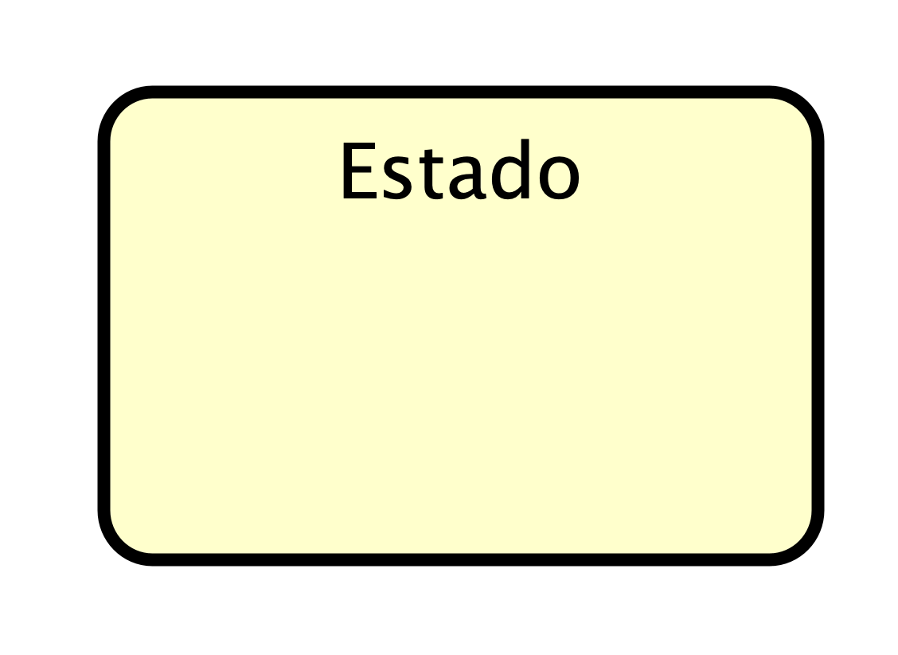
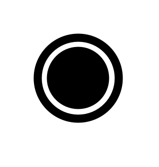
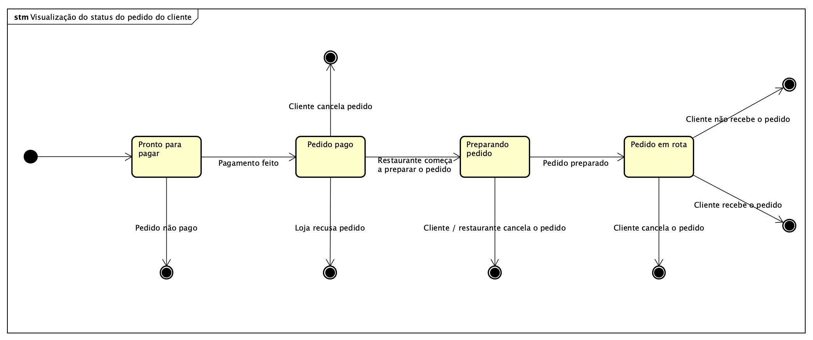
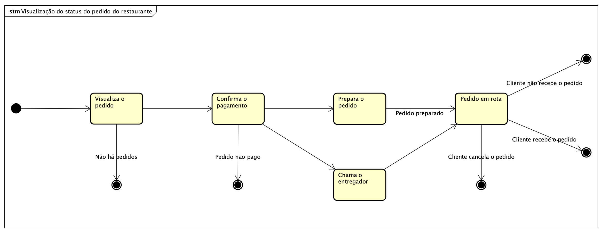
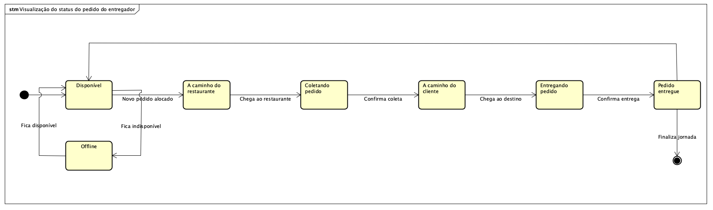
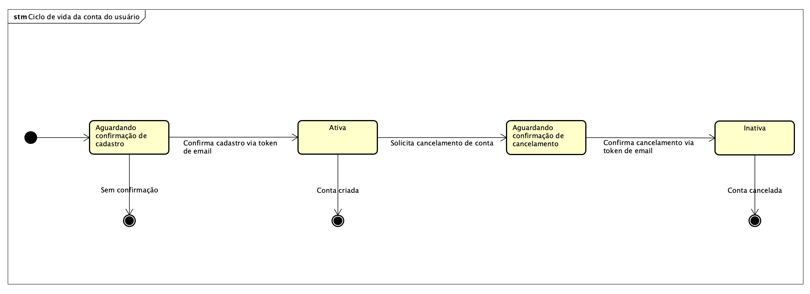

# Diagrama de Estados

# Introdução

O diagrama de estados é um tipo de diagrama dinâmico que procura representar os diferentes estados pelos quais um objeto pode passar <a id="anchor_1" onclick="document.getElementById('REF1').scrollIntoView()" style="cursor:pointer;">[1]</a>. Assim, conforme o passar do tempo, esse objeto irá mudar de estado quando ocorrer um evento interno ou externo ao sistema <a id="anchor_1" onclick="document.getElementById('REF1').scrollIntoView()" style="cursor:pointer;">[1]</a>.

## Componentes do Diagrama de Estados

| **Nome do Componente** | **Significado** | **Representação** |
| :---------------------- | :-------------- | :---------------- |
| **Estado Simples** | Um estado simples é um tipo de estado que **não apresenta subestados**, não possui regiões ou submáquinas de estado. Esse componente é representado por um **retângulo de cantos arredondados** com o nome do estado dentro do retângulo <a id="anchor_2" onclick="document.getElementById('REF2').scrollIntoView()" style="cursor:pointer;">[2]</a>. |  |
| **Pseudoestado Inicial** | Um pseudoestado inicial é responsável por representar um **vértice padrão** que é a fonte de uma única transição para o estado padrão de um estado composto. Ele é representado por um **círculo pequeno preenchido** por uma cor sólida <a id="anchor_2" onclick="document.getElementById('REF2').scrollIntoView()" style="cursor:pointer;">[2]</a>. |  |
| **Estado Final** | O estado final representa um tipo especial de estado utilizado para **sinalizar a conclusão** da região envolvente. Se essa região estiver contida em uma máquina de estados e todas as demais regiões também estiverem completas, isso significa que **toda a máquina de estados está completa** <a id="anchor_2" onclick="document.getElementById('REF2').scrollIntoView()" style="cursor:pointer;">[2]</a>. |  |

Autor: [Luiz Guilherme](https://github.com/luizfaria1989),[Fábio Gabriel](https://github.com/fabinsz) 2025.

Além desses componentes mais simples, para a conexão dos estados são utilizadas setas que mostram o fluxo dos diferentes estados além de indicar quais são os eventos que são responsáveis por ativar essa transição. A UML também permite outros componentes para a criação dos diagramas de estados, como estados compostos e pontos de decisão <a id="anchor_2" onclick="document.getElementById('REF2').scrollIntoView()" style="cursor:pointer;">[2]</a>.

# Diagramas Produzidos

## Quadro de Participações

| **Membro da equipe** | **Função** |
| :------------- | :--------- |
| [Luiz](https://github.com/luizfaria1989) | Documentação da página, desenvolvimento do diagrama de visualização do cliente e refatoração dos diagramas com o software Astah. |
| [João](https://github.com/Joao151104) | Desenvolvimento do diagrama de visualização do resturante. |
| [Rodrigo](https://github.com/rodrigoFAmaral) | Desenvolvimento do diagrama de visualização do entregador. |
| [Fabio](https://github.com/fabinsz) | Ajustes e desenvolvimento na documentação da página. |
| [Cayo](https://github.com/Cayoalencar) | Desenvolvimento do diagrama de ciclo de vida de uma conta de usuário no app. |

Para o desenvolvimento dos diagramas de estados, foi combinado com os integrantes do grupo que seriam desenvolvidos três diagramas diferentes que mostrem como será a visualização do cliente, restaurante e entregador quando um pedido for preparado e até ser entregue ao cliente.

## Visualização do Pedido para o Cliente

Autor: [Luiz Guilherme](https://github.com/luizfaria1989), 2025.

### Estados do Pedido

- **Pronto para pagar:** O pedido é criado e está aguardando o pagamento do cliente.

- **Pedido pago:** O pagamento foi confirmado e o pedido está pronto para ser enviado ao restaurante.

- **Preparando pedido:** O restaurante recebeu o pedido e começou a prepará-lo.

- **Pedido em rota:** O pedido já foi preparado e está a caminho do endereço do cliente.

### Transições e Possíveis Conclusões

O diagrama mostra como o pedido se move entre os estados com base em eventos específicos. Além disso, ele indica os pontos de finalização do processo, que podem ser tanto uma entrega bem-sucedida quanto um cancelamento.

- **Cancelamento:** O pedido pode ser cancelado em diferentes momentos. Por exemplo, se o pagamento não for realizado (Pedido não pago), o cliente desistir (Cliente cancela pedido) ou o restaurante recusar (Loja recusa pedido).

 - **Entrega:** O fluxo ideal ocorre quando o pedido é preparado, sai para entrega (Pedido em rota) e finalmente é recebido pelo cliente (Cliente recebe o pedido), encerrando o ciclo com sucesso.

## Visualização do Pedido para o Restaurante

Autor: [João](https://github.com/Joao151104), 2025.

### Estados do Pedido

- **Visualiza o pedido:** O primeiro estado, onde o restaurante recebe e visualiza um novo pedido.

- **Confirma o pagamento:** O restaurante verifica se o pagamento do pedido foi efetuado.

- **Prepara o pedido:** O restaurante começa a preparar o pedido para o cliente.

- **Chama o entregador:** O restaurante solicita o serviço de um entregador para levar o pedido.

- **Pedido em rota:** O pedido está em posse do entregador e a caminho do cliente.

### Transições e Eventos

- **Visualiza o pedido para Confirma o pagamento:** A transição acontece assim que o restaurante visualiza um pedido.

- **Confirma o pagamento para Prepara o pedido:** Ocorre quando o pagamento é confirmado.

- **Prepara o pedido para Chama o entregador:** O pedido passa para este estado quando está preparado e o restaurante solicita a entrega.

- **Chama o entregador para Pedido em rota:** Ocorre quando o entregador já está com o pedido para a entrega.

### Eventos de Finalização

- **Não há pedidos:** Se o restaurante não tiver pedidos, o processo é finalizado.

- **Pedido não pago:** Se o pagamento não for confirmado, o processo é encerrado.

- **Cliente cancela o pedido:** O cliente pode cancelar o pedido em qualquer momento. Neste diagrama, o cancelamento é ilustrado a partir do estado Pedido em rota.

- **Cliente recebe o pedido:** O pedido é entregue com sucesso, finalizando o processo.

- **Cliente não recebe o pedido:** Se a entrega falhar, o processo é encerrado.

## Visualização do Pedido para o Entregador

Autor: [Rodrigo](https://github.com/rodrigoFAmaral), 2025.

### Estados do Entregador

- **Disponível:** O entregador está online e pronto para aceitar novos pedidos.

- **Offline:** O entregador está indisponível para receber pedidos. Ele pode alternar entre Disponível e Offline.

- **A caminho do restaurante:** O entregador aceitou um pedido e está se deslocando para o restaurante.

- **Coletando pedido:** O entregador chegou ao restaurante e está pegando o pedido.

- **A caminho do cliente:** O entregador está com o pedido e está se deslocando para o endereço de entrega.

- **Entregando pedido:** O entregador chegou ao destino e está entregando o pedido ao cliente.

- **Pedido entregue:** O pedido foi entregue com sucesso, finalizando a jornada de entrega.

### Transições e Eventos

- **Disponível para A caminho do restaurante:** Ocorre quando um Novo pedido alocado é aceito pelo entregador.

- **A caminho do restaurante para Coletando pedido:** Ocorre quando o entregador Chega ao restaurante.

- **Coletando pedido para A caminho do cliente:** Ocorre quando o entregador Confirma coleta do pedido.

- **A caminho do cliente para Entregando pedido:** Ocorre quando o entregador Chega ao destino.

- **Entregando pedido para Pedido entregue:** Ocorre quando o entregador Confirma a entrega.

### Fluxo de Retorno e Finalização

- **Finalização da Jornada:** Após o pedido ser Entregue, o processo é finalizado (Finaliza jornada).

- **Retorno à Disponibilidade:** A partir do estado Pedido entregue, o entregador pode voltar ao estado Disponível para aceitar novas corridas, reiniciando o ciclo.

- **Alternância de Status:** O entregador pode alternar entre os estados Disponível e Offline a qualquer momento, o que permite controlar quando ele está apto a receber pedidos.

## Visualização do Ciclo de Vida de uma Conta de Usuário no App

Por fim, foi desenvolvido um último diagrama que tem como objetivo representar qual é o ciclo de vida de uma conta de usuário ao utilizar o aplicativo.

Autor: [Cayo](https://github.com/Cayoalencar), 2025.

### Estados da Conta

- **Aguardando confirmação de cadastro:** Ocorre quando uma nova conta está prestes a ser criada, mas ainda precisa de um código de verificação para que a conta seja concluída com sucesso.

- **Ativa:** Representa uma conta padrão no aplicativo, que pode funcionar tanto para um cliente já apto a fazer pedidos no aplicativo, como um restaurante, pronto para aceitar pedidos ou pode funcionar como uma conta de entregador, já estando disponível para fazer entregas de restaurantes até a FCTE.

- **Aguardando confirmação de cancelamento:** Representa uma conta que está prestes a ser desativada pelo usuário, mas que ainda precisa de uma código de verificação para que a conta seja cancelada com sucesso.

- **Inativa:** Representa uma conta padrão no aplicativo, seus dados ainda estão armazenados no banco de dados, mas não pode ser utilizada pelo usuário, seja ele cliente, restaurante ou entregador.

### Transições e Eventos

- **Confirma cadastro via token de email:** É o evento de transição responsável por transformar uma conta que está prestes a ser criada a uma conta já ativa no aplicativo, podendo ser utilizada por qualquer um dos três tipos de usuário.

- **Solicita cancelamento de conta:** É um evento que é solicitado pelo usuário quando ele deseja que sua conta seja excluída.

- **Confirma cancelamento via token de email:** É o evento de transição responsável por transformar uma conta ativa em uma conta inativa no aplicativo, ele é ativado pelo próprio usuário da conta ao digitar o token de email em seu app.

- **Conta cancelada:** É o evento que transforma uma conta inativa em uma conta excluída pelo aplicativo, uma conta que já foi excluída pelo aplicativo não apresenta suas informações no banco de dados.

---

# Referência Bibliográfica

> 1. <a onclick="document.getElementById('anchor_1').scrollIntoView()" style="cursor:pointer;"> Arquitetura e desenho de software, aula - projeto e desenho de software. Disponivel em:</a>: https://aprender3.unb.br/pluginfile.php/3178388/mod_page/content/1/Arquitetura%20e%20Desenho%20de%20Software%20-%20Aula%20Modelagem%20UML%20Dinâmica%20-%20Profa.%20Milene.pdf. Acesso em: 20 de setembro de 2025;

> 2. <a onclick="document.getElementById('anchor_11').scrollIntoView()" style="cursor:pointer;"> UML Diagrams Org. Disponível em: [https://www.uml-diagrams.org/state-machine-diagrams.html](https://www.uml-diagrams.org/state-machine-diagrams.html). Acesso em: 20 de setembro de 2025. 

---

# Histórico de Versões

| **Data**       | **Versão** | **Descrição**                         | **Autor**                                      | **Revisor**                                      | **Data da Revisão** |
| :--------: | :----: | :-------------------------------- | :----------------------------------------: | :----------------------------------------: | :-------------: |
| 20/09/2025 |  `1.0`   | Criação da página dos diagramas de estados e inserção dos primeiros diagramas. | [`@Luiz`](https://github.com/luizfaria1989) | [`@`](https://github.com/) |   00/00/0000    |
| 20/09/2025 |  `1.1`   | Adiciona o diagrama de estados para a visualização do entregador e a tabela de contribuições. | [`@Luiz`](https://github.com/luizfaria1989) | [`@`](https://github.com/) |   00/00/0000    |
| 21/09/2025 |  `1.2`   | Adiciona conteúdo descrevendo os diagramas de estados propostos e ajuste na tabela de componentes | [`@Fabio`](https://github.com/fabinsz) | [`@Luiz`](https://github.com/luizfaria1989) |  21/09/2025    |
| 21/09/2025 |  `1.3`   | Adiciona o diagrama de ciclo de vida de uma conta de usuário no app. | [`@Luiz`](https://github.com/luizfaria1989) | [`@`](https://github.com/) |   00/00/0000    |