# Diagrama de Classes

## Introdução

O Diagrama de classes é usado para descrever a estrutura estática de classes no sistema, permitindo definir os atributos, operações(métodos) e os relacionamentos entre as classes

## Diagrama de Classes PodePedirFCTE

O diagrama abaixo mostra a estrutura geral do sistema

  

## Classes

Após observar a visão geral, é importante detalhar cada classe individualmente.  

### Usuário

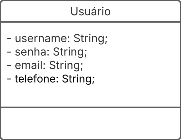

### Aluno

### Entregador

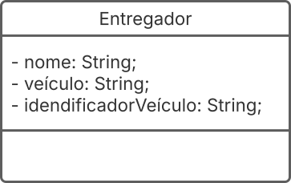

### Pagamento

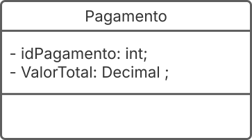

### Fornecedor

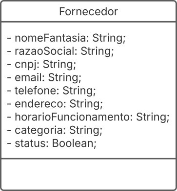

### CartaoPagamento

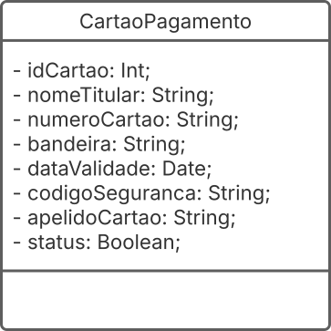

### Enum_Tipo

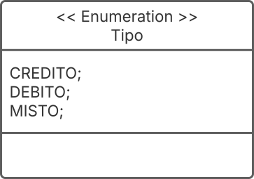

### Enum_Status_pagamento

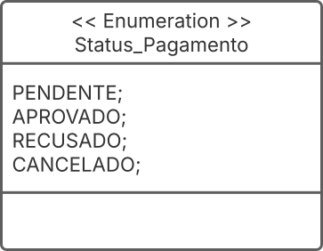

### Enum_Status_Entrega

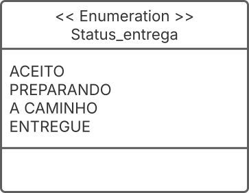

### Enum_Tipo_Pagamento

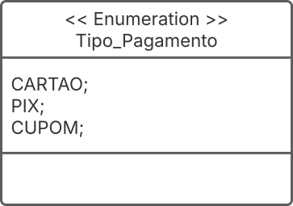

### Cardapio

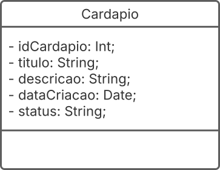

### item

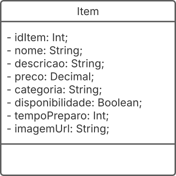

### Pedido

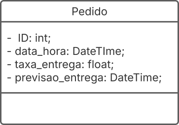

## Histórico de Versões

| **Data**       | **Versão** | **Descrição**                         | **Autor**                                      | **Revisor**                                      | **Data da Revisão** |
| :--------: | :----: | :-------------------------------- | :----------------------------------------: | :----------------------------------------: | :-------------: |
| 21/09/2025 |  `1.0`   | Criação da página do diagrama de classes. | [`@Fabinsz`](https://github.com/fabinsz) | [`@`](https://github.com/) |   00/00/0000    |